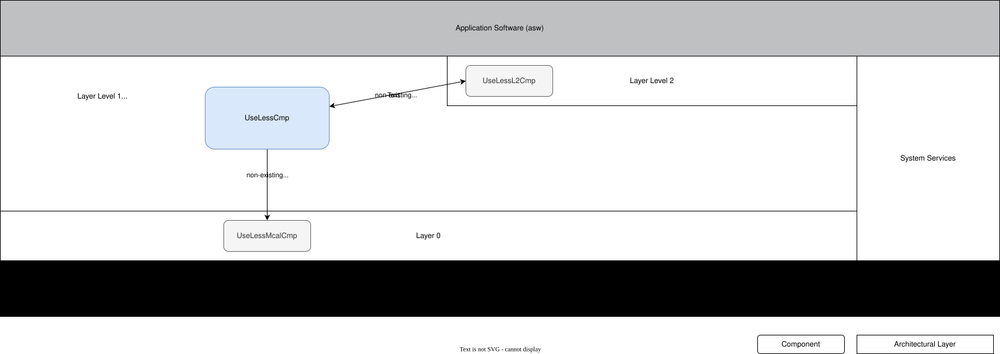

UselessCmp - Detailed Design (DRAFT)
====================================

.. TODO: this is a hack ... make this proper
..   :specified_by: ARCH_SW_Example_123456

.. arch-swc:: UselessCmp Component
   :id: SWC_UselessCmp
   :status: draft
   :specified_by: REQ_SW_L1ComponentA
   :feature: FeatureY

   The level 1 component **UselessCmp** is responsible for ... (one sentence summary of the component).

Purpose and Concept
---------------------------

.. Template Hints:
   - What is the purpose of the function to be designed?
   - What functionality is to be designed?
   - Is the function safety critical? If yes, describe what safety critical is.
   - The concept behind the function, algorithms, and high-level interactions

The **UselessCmp** component serves as an example component for demonstration and testing purposes within the software architecture. 
It does not provide critical functionality but is used to validate the build system, component integration patterns, and documentation structure.

This component demonstrates:

- Basic component structure and lifecycle management
- Interface patterns for level 1 components
- Integration with the requirements traceability system
- Documentation template usage

The component implements simple comparison operations or placeholder functionality that can be used as a reference implementation for new components.

Requirements
---------------------------

.. Template Hints:
   - Link to the software requirements relevant to this component.
   - Optional: List of requirements (tags, numbers, heading)

List of relevant requirements:

.. needtable::
   :columns: id, title, safety_integrity, security_relevance, verification_criteria
   :filter: type == 'req-sw' and ('SWC_UselessCmp' in specified_by_back)
   :sort: id

Integration into Software Architecture
------------------------------------------

.. Template Hints:
   - Block diagram: How are the new and/or adapted components integrated into the existing architecture (layers, interfaces, call sequence, storage, error handling, …) provided and required interfaces
   - Sequence diagrams showing interaction between this component and other components (if necessary)

(add block diagrams and sequence diagrams as needed)

   SWA Integration Architecture Diagram

List of Component Interfaces:

.. list-table::
   :header-rows: 1
   :widths: 20 30 40

   * - Interface Name
     - Connection
     - Description
   * - InterfaceA
     - to UselessL2Cmp bidirectional
     - exchanges data X and Y
   * - InterfaceB
     - to UselessMcalCmp unidirectional
     - send data Z

Design Constraints
---------------------------

.. Template Hints:
   - Any constraints which impact the design. This may include:
      - Integration constraints (size, execution time, process raster)
      - interface specifications e.g. Corba, DCOM
      - resource considerations,
      - the use of a specific design pattern,
      - mandated re-use of existing elements,
      - Variant handling 

- CMake variant handling following the platform standards.

Component Design
---------------------------

.. Template Hints:
   - Description of the design
   - Component diagram for new and/or adapted modules with interface description
   - If architectural relevant, describe also the internals of the module
      - Class diagrams 
   - (showing interactions between internal sub-components)
   - Design of safety critical part
      - How is the initialization ensured?
      - What calibration is required?

(add block diagrams and/or sequence diagrams as needed of the internal design, e.g. by using plantuml or drawio)

.. uml::
   :caption: Example of possible Component Internal Design in PlantUML
   :align: center
   :width: 100%

   @startuml
   
   package "UselessCmp Component" {
      [UselessCmp_Init] as Init
      [UselessCmp_MainFunction] as Main
      [UselessCmp_Compare] as Compare
      [UselessCmp_GetStatus] as Status
      
      database "Component State" as State {
         [Initialization Flag]
         [Comparison Result]
         [Status Data]
      }
      
      Init --> State : initialize
      Main --> Compare : call
      Main --> State : update
      Compare --> State : read/write
      Status --> State : read
   }
   
   interface "InterfaceA" as IFA
   interface "InterfaceB" as IFB
   
   IFA <--> Main : data X, Y
   Main --> IFB : data Z
   
   note right of Init
      Component initialization
      - Set default state
      - Initialize variables
   end note
   
   note right of Main
      Cyclic execution
      - Process inputs
      - Execute comparison logic
      - Update outputs
   end note
   
   @enduml

(add some explanation text about the design)

.. uml::
   :caption: Example of a possible Component Interaction Sequence in PlantUML
   :align: center
   :width: 100%

   @startuml
   
   participant "System Scheduler" as Scheduler
   participant "UselessCmp" as Cmp
   participant "UselessL2Cmp" as L2
   participant "UselessMcalCmp" as Mcal
   participant "Component State" as State
   
   == Initialization Phase ==
   Scheduler -> Cmp : UselessCmp_Init()
   activate Cmp
   Cmp -> State : Set initialization flag
   Cmp -> State : Initialize default values
   Cmp --> Scheduler : return
   deactivate Cmp
   
   == Cyclic Execution ==
   loop Every execution cycle
      Scheduler -> Cmp : UselessCmp_MainFunction()
      activate Cmp
      
      Cmp -> L2 : Read data X, Y via InterfaceA
      activate L2
      L2 --> Cmp : Return data X, Y
      deactivate L2
      
      Cmp -> Cmp : UselessCmp_Compare(X, Y)
      Cmp -> State : Store comparison result
      
      Cmp -> Mcal : Send data Z via InterfaceB
      activate Mcal
      Mcal --> Cmp : Acknowledge
      deactivate Mcal
      
      Cmp -> State : Update status
      Cmp --> Scheduler : return
      deactivate Cmp
   end
   
   == Status Query ==
   Scheduler -> Cmp : UselessCmp_GetStatus()
   activate Cmp
   Cmp -> State : Read status data
   State --> Cmp : Return status
   Cmp --> Scheduler : Return status
   deactivate Cmp
   
   @enduml

Configuration
---------------------------

.. 
   - Configuration (e.g. Parameters like #defines etc.)

This component does not require specific configuration parameters. Configuration parameters are not yet defined as needs at this time.

.. needtable::
   :columns: id, title
   :filter: type == 'conf' and ('IMPL_UselessCmp' in verify)
   :sort: id

.. or a manual table

Errors
---------------------------

.. 
   - Errors list of what the component can detect/return.

This component does not implement any error handling at the moment. Errors are not yet defined as needs at this time.

.. needtable::
   :columns: id, title
   :filter: type == 'error' and ('IMPL_UselessCmp' in verify)
   :sort: id

Testing
---------------------------

..
   - Test description, not fully defined, only collection of test ideas
   - Description of tests to be performed 

This component does implement unit tests to verify its basic functionality and integration within the software architecture.

Unit tests:

.. needtable::
   :columns: id, title
   :filter: type == 'test' and ('IMPL_UselessCmp' in verify)
   :sort: id

UselessCmp - Implementations
================================

.. src-trace::
   :project: basic_dev_setup
   :directory: ./moduleA/l1/uselessCmp

